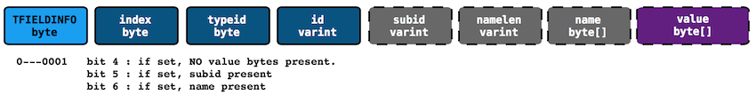
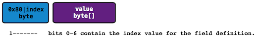
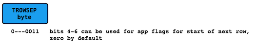
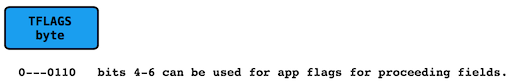
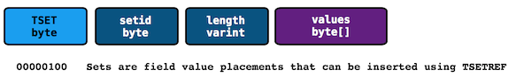
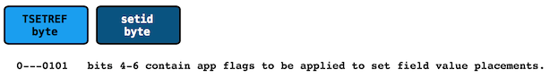

# Crow Encoding Spec

The Crow binary format is designed to be compact and flexible.  This document details how the data is encoded.

## Definitions
 - **Varint encoding** Method of encoding integer values in fewer bytes depending on how many zero-bytes / bits are present.  It uses the upper bit in each byte to indicate that the value continues with the next byte.  This is used in Google Protobuf format.
 - **Zigzag encoding** Method of encoding signed values in a more compact format.
 - **Row** A collection of values, such as a row in a CSV data file.  Row is used synonymously with Message.
 - **Message** A collection of field values.  Used synonymously with Row.

## Field Definitions
The first time a field is encountered, the encoder will write it's definition.  The encoding application should organize data in block, and the definitions should be provided at the start of the block.

 - **index** : The zero-based index of the field.  The first field encountered has index 0, the second field has index 1, and so on.
 - **typeid** : Indicates the data type of the field (string, int32, uint8, float32, bytes, etc.)
 - **id** : Application provided ID for the field, which is optional if the name is provided.  Encoding Netflow or IPFIX will use the id as the field IE ID.
 - **subid** : Optional Application provided ID.  This can be used for the IPFIX PEN.
 - **name** : Name for the field, which is optional if the id is provided.  A typical CSV file will have a header line with names.

The *tagid* byte has 3 flags that are used to determine the presence of the optional fields.  *The ONLY situation where value bytes are not present, is when a new field is encountered when build a set.*

## Field Value Placements

Subsequent data values are placed using a single *tagid* byte followed by it's data bytes.  The decoder looks up the field definition using the index encoded in the *tagid* byte.  The field definition includes the typeid, which the decoder can use to interpret the value bytes.

*NOTE: currently there should not be more than one instance of the same field in the same message or row*

## End of Row or Message
A single byte is used to mark the end of the current row or message.

## Flags

Application flags augment the context of field values.  For the Netflow/IPFIX scenario, the flags can be used to indicate direction, and therefore make bi-directional flows very easy to encode.

## Set Definition
A *Set* is a collection of field value placements that can be referenced multiple times.  Consider a wide-table that is really a join of multiple relations.  A group of fields may represent a host, for example (IPAddress, Hostname, SessionID, GeoLocation, etc.).  Multiple rows of data referencing the same host will repeat those values over and over.  Crow Sets allow an application to optimize relations to improve encoding.

## Set Reference

A Set Reference consists of a tagid byte, followed by a *setid* byte.  This instructs the decoder to lookup the Set, and place it inline in the output.  There is a limit of 255 active sets in a block.  The flags fields can be used by the application to provide context for the placed set fields (see Flags section above).

